<div align="center">

# 🦷 Dental Clinic Management System

### A Modern Full-Stack Dental Clinic Management System

Manage patients, doctors, appointments, finance, expenses, debts, and daily clinic operations in one integrated platform.

---


</div>

---

# 📖 Overview

Dental Clinic Management System is a complete web application designed to simplify daily clinic operations.

The system allows administrators, doctors, and receptionists to manage patients, appointments, financial records, expenses, debts, and treatment history through an intuitive and responsive interface.

---

# ✨ Features

## 👨‍⚕️ Patient Management

- Register new patients
- Edit patient information
- Patient treatment history
- Follow-up visits
- Medical notes
- Patient images upload
- Payment tracking
- Remaining balance calculation

---

## 🩺 Doctor Management

- Manage doctors
- Doctor working hours
- Doctor specialization
- Doctor dashboard
- Daily patient list
- Today's appointments
- Revenue tracking
- Doctor percentage calculation

---

## 📅 Appointment Management

- Create appointments
- Reschedule appointments
- Cancel appointments
- Appointment status tracking
- Today's appointments
- Doctor schedule
- Follow-up appointments
- Automatic available slots

---

## 💰 Financial Management

- Daily income
- Monthly income
- Total revenue
- Doctor share
- Remaining payments
- Payment history
- Financial dashboard

---

## 💸 Expense Management

- Add expenses
- Expense categories
- Monthly expenses
- Search & filters
- Expense reports

---

## 🚨 Debt Alerts

- Outstanding balances
- Total debts
- Patient debt list
- Remaining payment tracking

---

## 📊 Dashboard

- Total patients
- Active doctors
- Today's revenue
- Monthly revenue
- Total debts
- Expenses summary
- Charts & statistics

---

## 🔐 Authentication

- Secure Login
- JWT Authentication
- Role-based Authorization
- Protected Routes

---

## 👥 User Roles

### 👑 Admin

- Full system access
- Manage doctors
- Manage receptionists
- Manage patients
- Financial reports
- Expenses
- Dashboard

---

### 👨‍⚕️ Doctor

- View today's appointments
- View assigned patients
- Update diagnosis
- Treatment plan
- Patient history

---

### 🧑‍💼 Receptionist

- Register patients
- Schedule appointments
- Receive payments
- Search patients
- Daily patient list

---

# 📱 Responsive Design

The application is fully responsive and optimized for:

- 📱 Mobile
- 📱 Tablet
- 💻 Laptop
- 🖥 Desktop

---

# 📸 Screenshots

## Landing Page

<p align="center">
  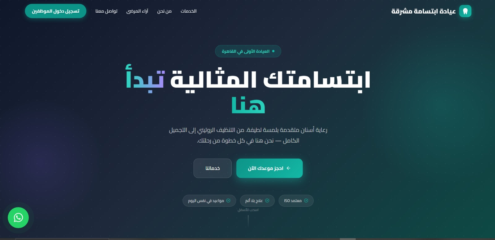
</p>
<p align="center">
  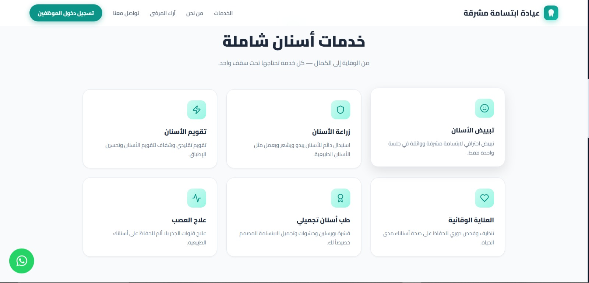
</p>
<p align="center">
  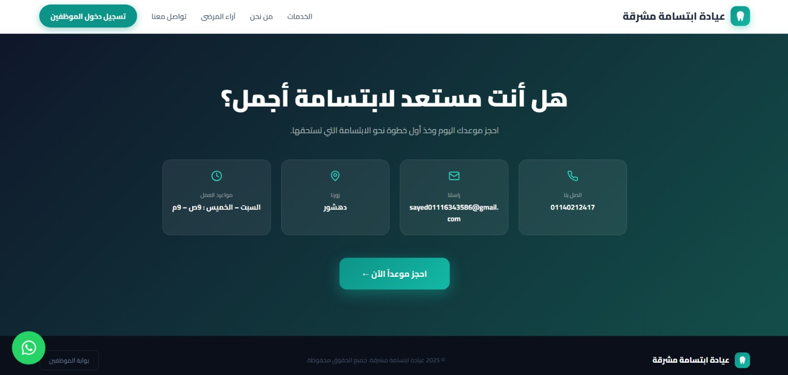
</p>

---

## Dashboard (Doctor)

<p align="center">
  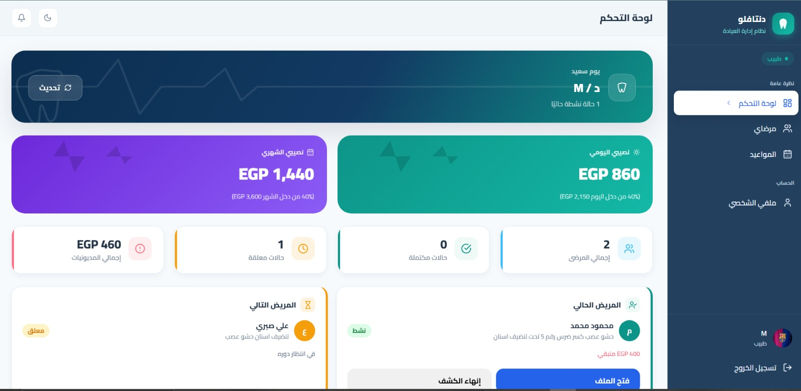
</p>
<p align="center">
  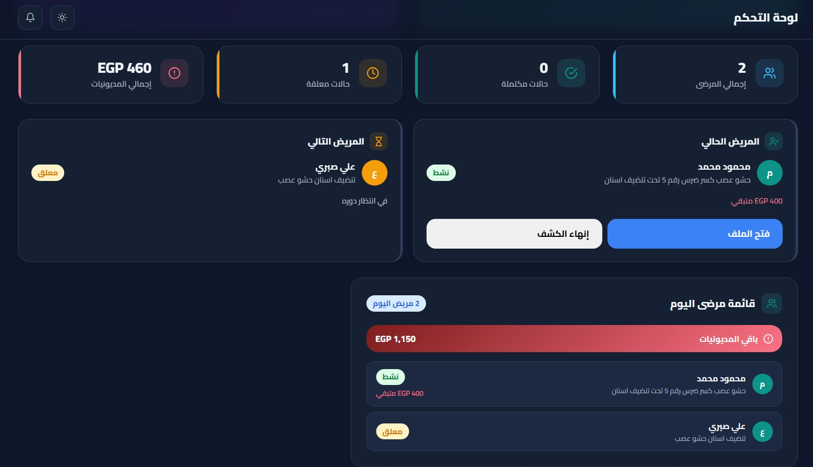
</p>

---

## Dashboard (Admin / Receptionist)

<p align="center">
  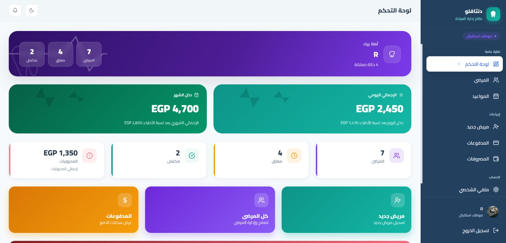
</p>
<p align="center">
  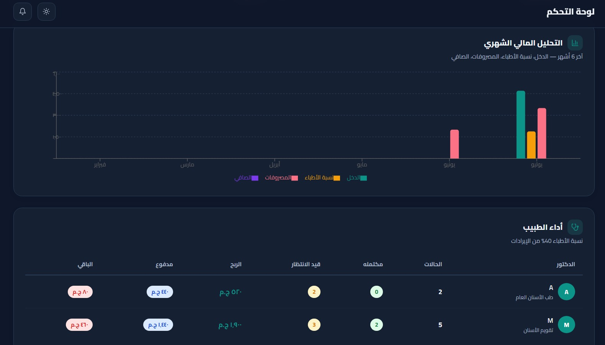
</p>

---

## Patients

<p align="center">
  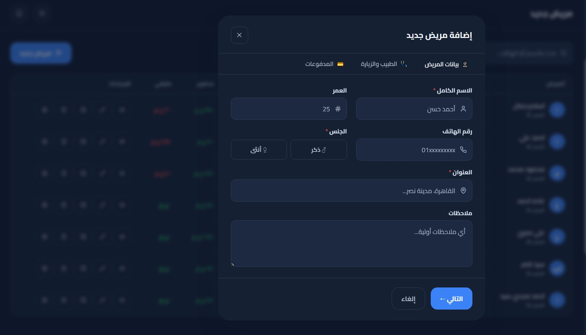
</p>

---

## Patient Details

<p align="center">
  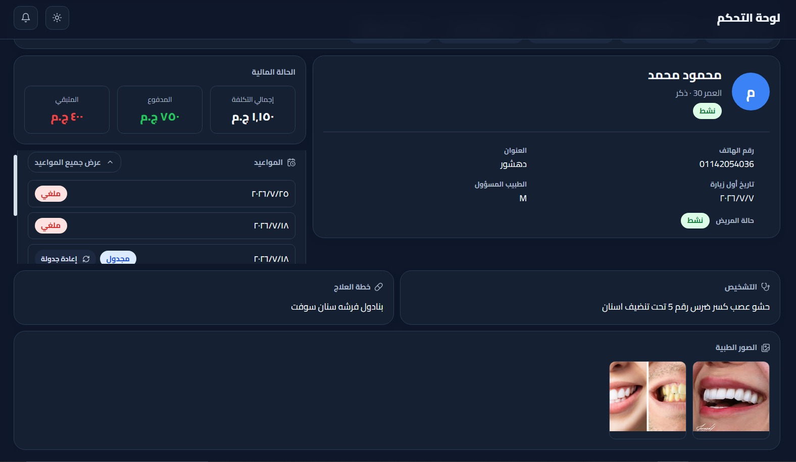
</p>

---

## Appointments

<p align="center">
  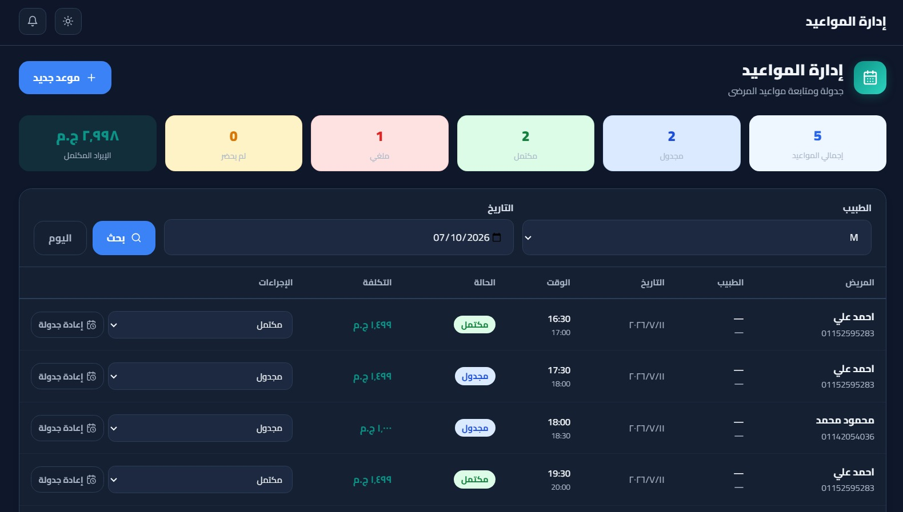
</p>

---

## Finance / Payments

<p align="center">
  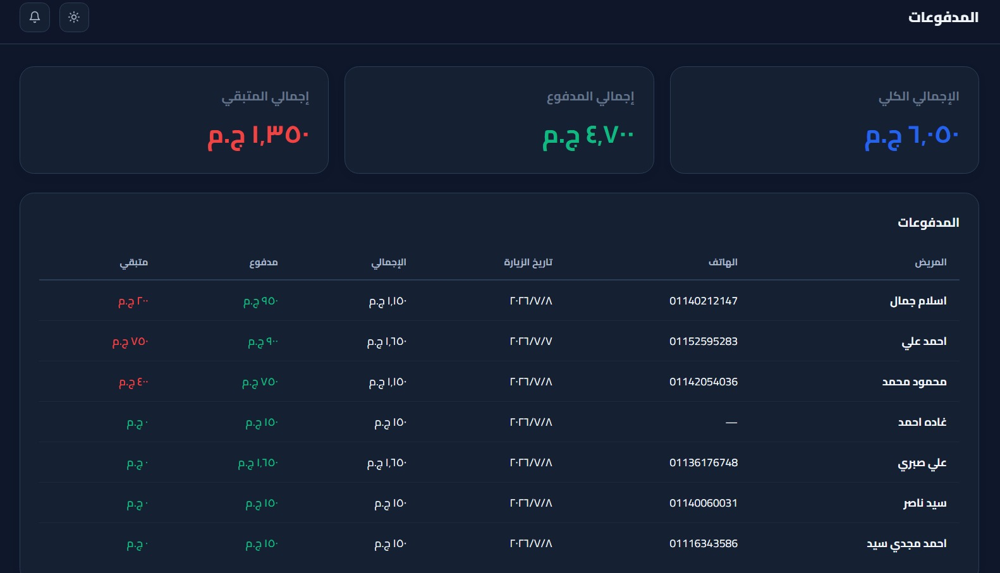
</p>

---

## Expenses

<p align="center">
  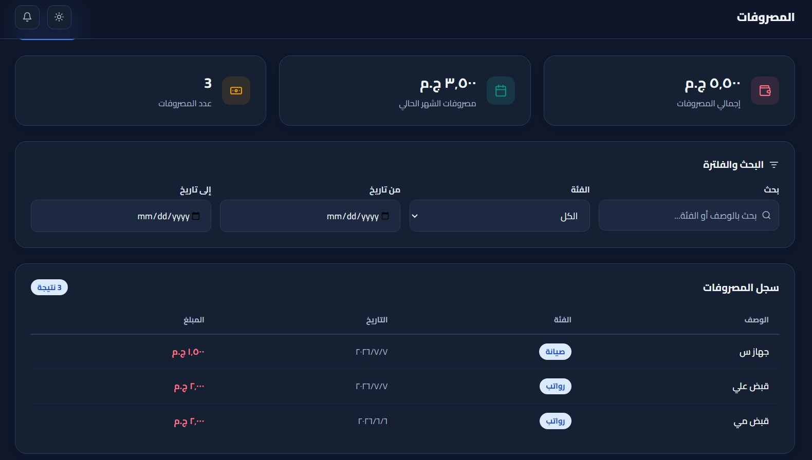
</p>

---

## Debt Alerts

<p align="center">
  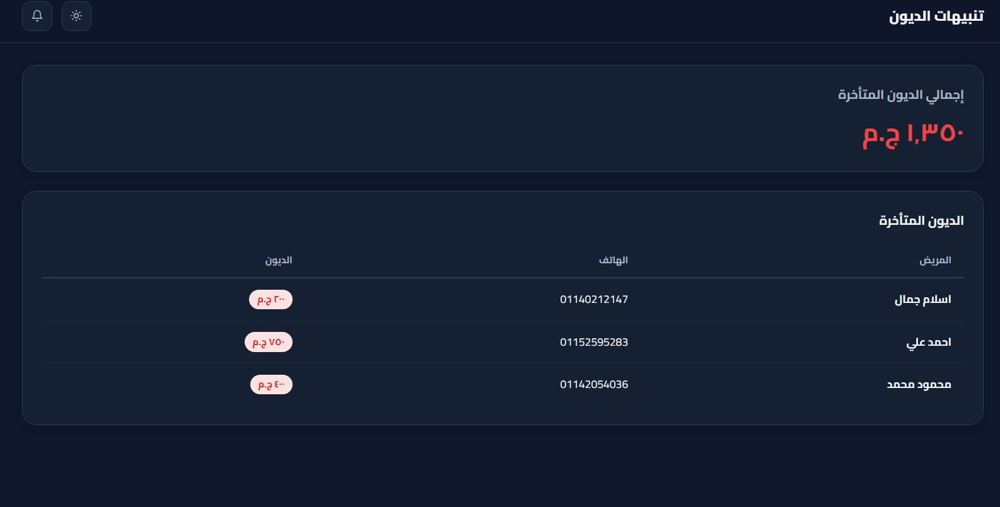
</p>

---

# 🛠 Tech Stack

## Frontend

- React
- Vite
- JavaScript
- Tailwind CSS
- Lucide React
- Recharts
- React Router
- Context API

---

## Backend

- Node.js
- Express.js
- MongoDB
- Mongoose
- JWT
- Multer
- Cloudinary
- Redis
- Helmet
- CORS

---

# 📂 Project Structure

```
Dental-Clinic-System
│
├── client
│   ├── public
│   ├── src
│   │
│   ├── api
│   ├── assets
│   ├── components
│   ├── context
│   ├── hooks
│   ├── layouts
│   ├── pages
│   ├── services
│   ├── utils
│   └── App.jsx
│
├── server
│   ├── DB
│   ├── modules
│   ├── middlewares
│   ├── routes
│   ├── services
│   ├── utils
│   ├── app.js
│   └── server.js
│
├── screenshots
│
└── README.md
```

---

# 🚀 Installation

## Clone Repository

```bash
git clone https://github.com/your-username/Dental-Clinic-System.git
```

```bash
cd Dental-Clinic-System
```

---

## Frontend

```bash
cd client
```

```bash
npm install
```

```bash
npm run dev
```

---

## Backend

```bash
cd server
```

```bash
npm install
```

```bash
npm run dev
```

---

# ⚙ Environment Variables

Create a `.env` file inside the server folder.

```env
PORT=3000

DB_URI=

JWT_SECRET=

ACCESS_SECRET=

REFRESH_SECRET=

ACCESS_EXPIRES_IN=

REFRESH_EXPIRES_IN=

REDIS_URL=

CLOUDINARY_CLOUD_NAME=

CLOUDINARY_API_KEY=

CLOUDINARY_API_SECRET=

ORIGIN=http://localhost:5173
```

---

# 📊 Main Modules

- Authentication
- Users
- Doctors
- Patients
- Appointments
- Finance
- Expenses
- Debts
- Reports
- Dashboard
- Notifications

---

# 🔒 Security

- JWT Authentication
- Password Hashing
- Protected Routes
- Role Permissions
- Rate Limiting
- Helmet Security
- CORS Protection

---

# ☁ Deployment

The application can be deployed using:

- Vercel (Frontend)
- Render
- Railway
- VPS
- Docker

---

# 📈 Future Improvements

- SMS Notifications
- WhatsApp Integration
- Email Notifications
- Online Booking
- AI Appointment Suggestions
- Medical Reports PDF
- Multi-Clinic Support
- Inventory Management
- Prescription Printing
- Backup & Restore

---

# 🤝 Contributing

Contributions are welcome!

1. Fork the project
2. Create your feature branch

```bash
git checkout -b feature/NewFeature
```

3. Commit your changes

```bash
git commit -m "Add New Feature"
```

4. Push

```bash
git push origin feature/NewFeature
```

5. Open a Pull Request

---

# 📄 License

This project is licensed under the MIT License.

---

# 👨‍💻 Author

**Sayed Mansour**

Dental Clinic Management System

⭐ If you like this project, don't forget to give it a Star on GitHub!
